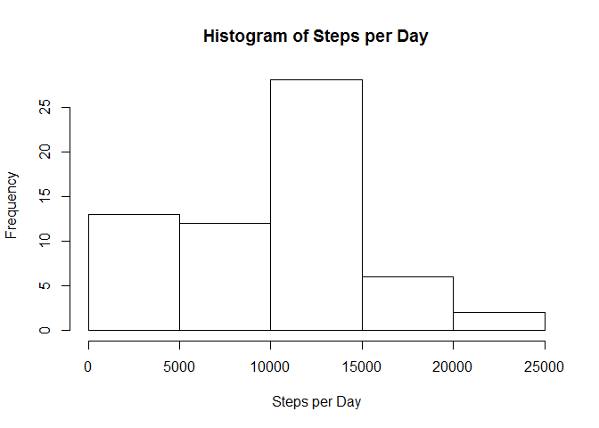
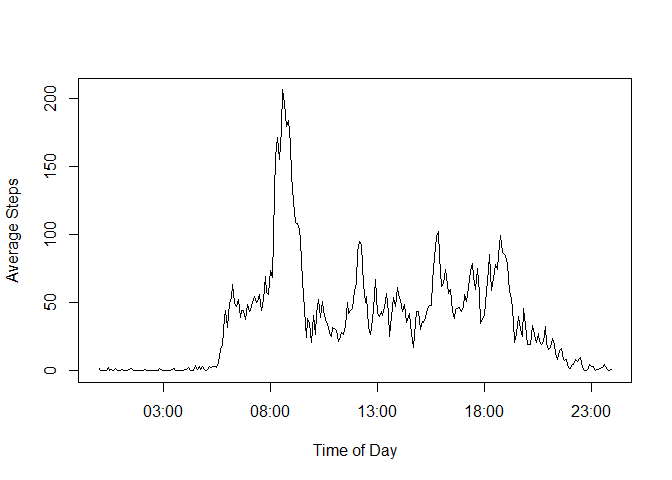
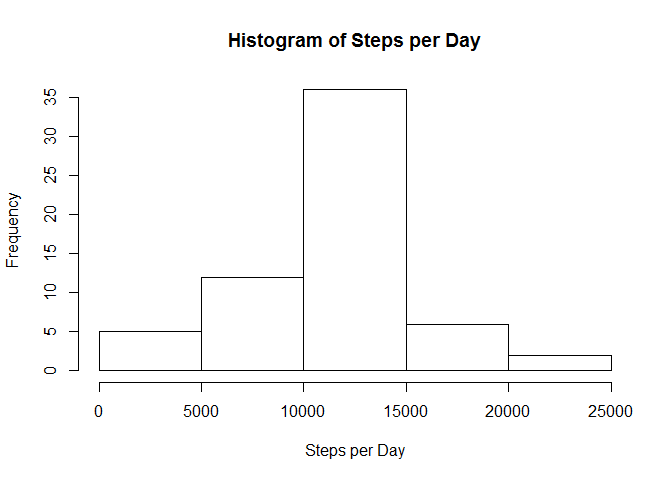
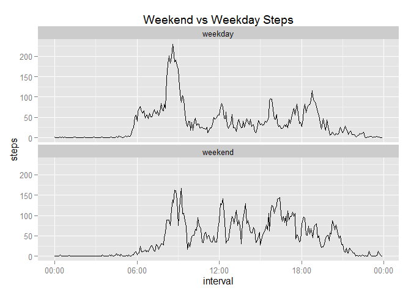

# Reproducible Research: Peer Assessment 1


## Loading and preprocessing the data

Load the data in and convert the date variable to a date format


```r
library(lubridate)
dat <- read.csv("activity.csv", colClasses = c("numeric", "character", "numeric"))
dat$date <- as.Date(dat$date, "%Y-%m-%d")
dat$interval <- strptime(sprintf("%04d",dat$interval), "%H%M", tz="GMT")
```

## What is mean total number of steps taken per day?

Sum the steps by day, plot the number of steps per day


```r
daysteps <- tapply(dat$steps, dat$date, FUN=sum, na.rm = TRUE)
hist(daysteps, main="Histogram of Steps per Day", xlab="Steps per Day")
```

 

The mean and median number of steps per day are:


```r
mean(daysteps)
```

```
## [1] 9354.23
```

```r
median(daysteps)
```

```
## [1] 10395
```

## What is the average daily activity pattern?

Now calculate the average number of steps taken each 5 minute interval throughout the day, and plot the average across the days


```r
timesteps <- tapply(dat$steps, as.numeric(dat$interval), FUN=mean, na.rm = TRUE)
plot(unique(dat$interval), timesteps, type="l", xlab = "Time of Day", ylab = "Average Steps")
```

 

Which 5-minute interval, on average, has the highest average number of steps?


```r
timesteps[match(max(timesteps),timesteps)]
```

```
## 1447490100 
##   206.1698
```

The maximum is 206.1698 steps between 8:35 and 8:40.  
## Imputing missing values

Total number of missing values:

```r
sum(is.na(dat$steps))
```

```
## [1] 2304
```

Replace missing values with the average from the 5-minute interval across all days as a new data set


```r
dat2 <- dat
dat2$steps[is.na(dat2$steps)] <- rep(timesteps, times=61)[is.na(dat2$steps)]
```

Make a histogram of the new data

```r
daysteps2 <- tapply(dat2$steps, dat2$date, FUN=sum, na.rm = TRUE)
hist(daysteps2, main="Histogram of Steps per Day", xlab="Steps per Day")
```

 

And calculate the mean and median:


```r
mean(daysteps2)
```

```
## [1] 10766.19
```

```r
median(daysteps2)
```

```
## [1] 10766.19
```

The impact of this is to make the mean and median equal, and reduces the skewness of the distribution.

## Are there differences in activity patterns between weekdays and weekends?


```r
dat2$day <- weekdays(dat2$date, abbreviate = TRUE)
dat2$day[dat2$day=="Sat" | dat2$day=="Sun"] <- "weekend"
dat2$day[!(dat2$day=="weekend")] <- "weekday"
dat2$day <- factor(dat2$day)
library(ggplot2)
library(scales)
ggplot(dat2, aes(x=interval,y=steps))+stat_summary(fun.y='mean', geom="line")+facet_wrap(~ day,ncol=1)+ggtitle("Weekend vs Weekday Steps")+scale_x_datetime(labels=date_format("%H:%M"))
```

 

Yes, as one might expect, walking activity is higher during commuting times (early morning and evening).  Walking activity on weekends is more evenly distributed throughout the day.
